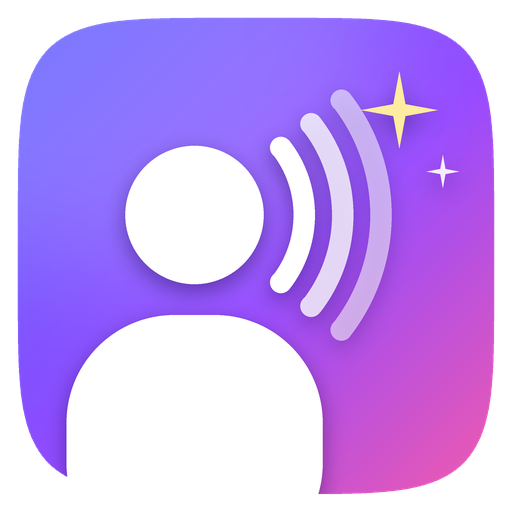
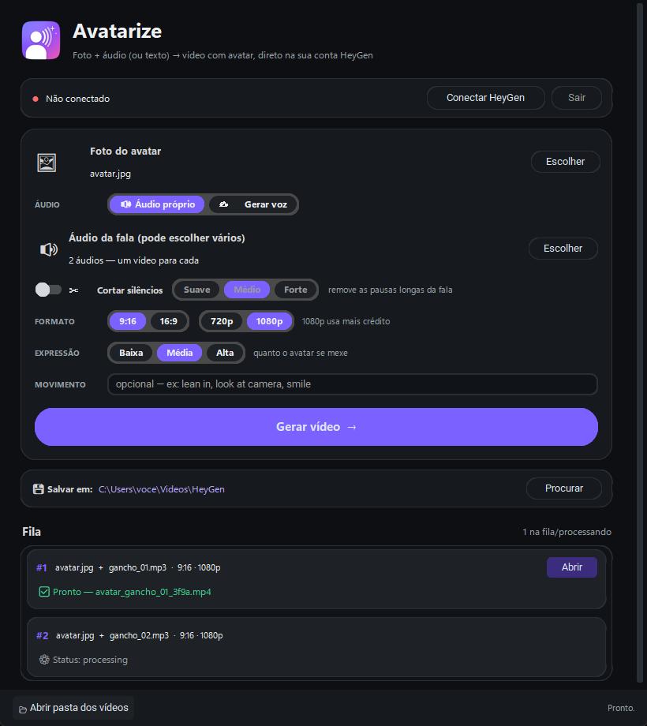

<p align="center">
  
</p>

<h1 align="center">Avatarize</h1>

<p align="center">
  App desktop para Windows que transforma <b>foto + áudio</b> (ou <b>foto + texto + voz</b>) em vídeo de avatar falando,
  usando a <b>sua conta HeyGen</b> pelo servidor MCP oficial.
</p>

<p align="center">
  <a href="https://github.com/rafaguiar-dev/avatarize/releases/latest"><b>⬇️ Baixar o Avatarize.exe</b></a>
</p>

<p align="center"></p>

## O que faz

- **Foto + áudio → vídeo**: escolha uma foto e um ou vários áudios (sai um vídeo para cada).
- **Foto + texto → vídeo**: escreva o texto e escolha uma voz da HeyGen (Starfish, ElevenLabs, Cartesia, Fish, ByteDance, Panda).
- **Clonar sua voz** uma vez e usar depois em "⭐ Minhas vozes".
- Formato **9:16** ou **16:9**, **720p** ou **1080p**, nível de **expressão** e **movimento** opcional (ex.: `lean in, look at camera`).
- **Cortar silêncios** do áudio antes de enviar (precisa do [ffmpeg](https://ffmpeg.org/download.html)).
- **Fila**: adicione vários vídeos; eles são gerados em sequência e baixados como MP4 em `Vídeos\Avatarize`.
- Converte sozinho foto e áudio para o que a HeyGen aceita (JPG/PNG e MP3/WAV) e limpa metadados pesados de MP3.

O vídeo é gerado direto da foto: nenhum avatar é criado na sua conta.

## Como usar

1. Baixe e abra o `Avatarize.exe` ([Releases](https://github.com/rafaguiar-dev/avatarize/releases/latest)).
   O executável não tem assinatura digital, então o Windows pode avisar "editor desconhecido": clique em *Mais informações → Executar assim mesmo*.
   Confira o SHA-256 publicado na Release se quiser ter certeza de que o arquivo é o original.
2. **Conectar HeyGen** → o site da HeyGen abre no navegador; entre e autorize. Volte ao app.
3. Escolha a foto, o áudio (ou o texto e a voz), o formato, e clique em **Gerar vídeo**.

## Segurança

- **Sua senha nunca passa pelo app.** O login é OAuth no site da HeyGen (com PKCE e verificação de `state`).
- **Token criptografado** com DPAPI do Windows em `%LOCALAPPDATA%\Avatarize\session.bin`: só o seu usuário do Windows, neste PC, consegue abrir. **Sair** apaga a sessão.
- O retorno do login usa um servidor de uso único só em `127.0.0.1`, que expira em 5 minutos.
- O app só conversa com `https://mcp.heygen.com/mcp/v1/` e com os links de upload/download que a HeyGen devolve, e **recusa qualquer link que não seja HTTPS** (inclusive em redirecionamentos).
- Sem telemetria. Arquivos temporários são apagados ao fim de cada vídeo.
- Dependências fixadas com hash em `uv.lock`; o `.exe` é gerado pelo `build.ps1`, que roda os testes antes.

## Rodar pelo código

Precisa do [uv](https://docs.astral.sh/uv/) (ele instala o Python certo sozinho).

```bash
git clone https://github.com/rafaguiar-dev/avatarize.git
cd avatarize
uv run python -m avatarize
```

**Gerar o .exe** (sai em `dist\Avatarize.exe`, com o SHA-256 no final):

```bash
powershell -ExecutionPolicy Bypass -File build.ps1
```

**Testes** (offline, não tocam na sua conta):

```bash
uv run python tests/smoke_test.py
```

**Diagnóstico** — lista as ferramentas e parâmetros que o MCP da HeyGen aceita hoje (útil se a HeyGen mudar algo):

```bash
uv run python -m avatarize --list-tools
```

## Estrutura

```
avatarize/
  ui.py            interface (customtkinter) e fila
  service.py       fluxos: vídeo, vozes, clonagem, conta
  heygen.py        sessão MCP e leitura das respostas
  auth.py          login OAuth + retorno em 127.0.0.1
  secure_store.py  arquivo de sessão criptografado (DPAPI)
  media.py         conversões de foto/áudio, corte de silêncio (ffmpeg)
  net.py           upload/download só HTTPS
tools/make_icon.py gera o ícone
tests/             testes offline
```

## Aviso

Projeto independente, sem vínculo com a HeyGen. "HeyGen" é marca dos seus respectivos donos. O uso de créditos e os vídeos gerados seguem os termos da sua conta HeyGen.

## Licença

[MIT](LICENSE)
